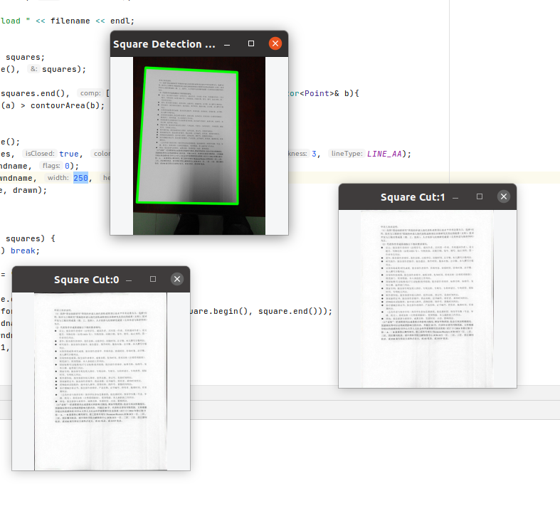
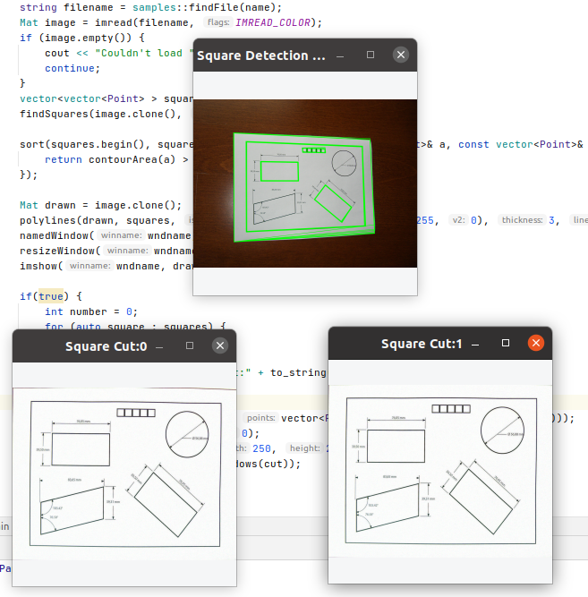

# Detect Paper

Detects a sheet of paper

  

## Screenshots

 
 
Credit:
* [4 Point OpenCV getPerspective Transform Example](https://www.pyimagesearch.com/2014/08/25/4-point-opencv-getperspective-transform-example/)
* [How to Build a Kick-Ass Mobile Document Scanner in Just 5 Minutes](https://www.pyimagesearch.com/2014/09/01/build-kick-ass-mobile-document-scanner-just-5-minutes/)
* [The "Square Detector" program, OpenCV](https://docs.opencv.org/4.3.0/db/d00/samples_2cpp_2squares_8cpp-example.html)
* [OpenCV C++/Obj-C: Detecting a sheet of paper / Square Detection](https://stackoverflow.com/questions/8667818/opencv-c-obj-c-detecting-a-sheet-of-paper-square-detection)
* [Algorithm to detect corners of paper sheet in photo](https://stackoverflow.com/questions/6555629/algorithm-to-detect-corners-of-paper-sheet-in-photo)
----
